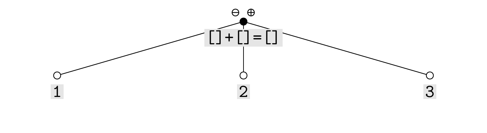

# WillowTikZ

This simple Haskell program illustrates the use of a functorial parser to generate TikZ pictures of willows (trees with respectively a labeled $\scriptstyle\ominus$ and $\scriptstyle\oplus$ node on the leftmost and rightmost branch) from an input string containing square brackets.

## Instructions

Clone the repository. To generate the source code for the TikZ picture corresponding to the example string `[1]+[2]=[3]` run:

```
runhaskell WillowTikZ.hs "[1]+[2]=[3]"
```

After compiling the generated LaTeX code, you get:



The generated picture can also be used within other documents. Simply copy the file `willow.sty` to the directory of your LaTeX project. Then you can use the TikZ picture as follows:

```
\documentclass{article}
\usepackage{standalone}
\usepackage{willow}
\begin{document}
Here is an example figure:
\begin{figure}[ht]
	\centering
	\input{generated-willow.tex}
	\caption{An example willow.}
\end{figure}
\end{document}
```

Only alpha-numeric characters and any of `'+', '-', '=', '.', ',', ';', ' ', '[', ']'` are accepted in the input string. Labels which are longer than 10 characters are truncated.

## Compiling

The file `Willows.hs` has been extracted from the Coq code `willows.v`. To extract it yourself, run:

```
coqc willows.v
```

To compile the Haskell code to an executable, run:

```
ghc WillowTikZ.hs
```
